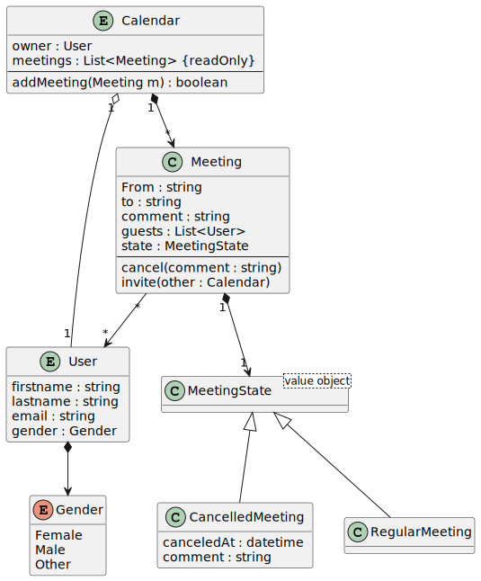

# A simple meeting planner

## Model

See https://khalilstemmler.com/articles/uml-cheatsheet/,
https://www.guru99.com/association-aggregation-composition-difference.html



```plantuml
@startuml
hide empty methods

enum Gender {
    Female
    Male
    Other
}

entity User {
    firstname : string
    lastname : string
    email : string
    gender : Gender
}

User *--> Gender

entity Calendar {
    owner : User
    meetings : List<Meeting> {readOnly}
    ---
    addMeeting(Meeting m) : boolean
}

class MeetingState <value object> {

}

class CancelledMeeting {
    canceledAt : datetime
    comment : string
}

CancelledMeeting -up-|> MeetingState
RegularMeeting -up-|> MeetingState

class Meeting {
    From : string
    to : string
    comment : string
    guests : List<User>
    state : MeetingState
    ---
    cancel(comment : string)
    invite(other : Calendar)
}

Calendar "1" o-- "1" User
Calendar "1" *--> "*" Meeting
Meeting "*" --> "*" User
Meeting "1" *--> "1" MeetingState
@enduml

```

### Remarks

- A calendar needs a user as an owner to work properly. So we need an *aggregation*. A user
  can exist without a calendar, and a user is queryable by the database (entity class). So
  there is no composition.
- A calendar contains a list of meetings. Meeting is a "normal" class (not an entity), and we
  should not modify the meeting table without calling *addMeeting*. So we use a *composition*
  to show this fact.
- A meeting does not neet guests to work properly. So there is no aggregation between *Meeting*
  and *User*. We use a simple association.

## Scaffolding the project

```
md SpgTimePlanner
cd SpgTimePlanner
md SpgTimePlanner.Application
cd SpgTimePlanner.Application
dotnet new classlib
dotnet add package Microsoft.EntityFrameworkCore --version 6.*
dotnet add package Microsoft.EntityFrameworkCore.Sqlite --version 6.*
dotnet add package Microsoft.EntityFrameworkCore.Proxies --version 6.*
dotnet add package Bogus --version 34.*
cd ..
md SpgTimePlanner.Test
cd SpgTimePlanner.Test
dotnet new xunit
dotnet add reference ..\SpgTimePlanner.Application
cd ..
dotnet new sln
dotnet sln add SpgTimePlanner.Application
dotnet sln add SpgTimePlanner.Test
start SpgTimePlanner.sln

```

