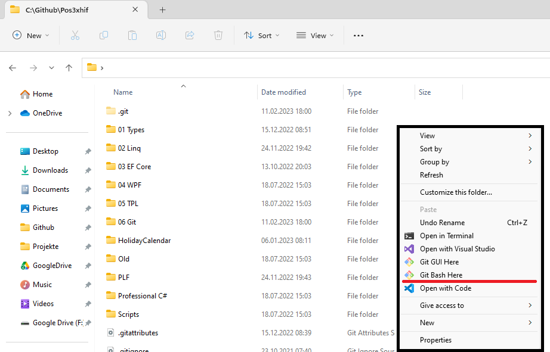

# Installation und Konfiguration von git

## Installation

Git ist im Kern ein Kommandozeilentool, mit dessen Hilfe ein Repository verwaltet werden kann.
Falls du git noch nicht installiert hast, kannst du das Programm von https://git-scm.com/downloads
laden. Verwende bei allen Dialogen die Standardeinstellung.

## Konfiguration von git

Bei Commits wird dein Name angeführt. Setze daher deinen echten Namen in der Konfiguration des
*git* Tools:

```
git config --global user.name "Vorname NachnameOhneNachdenkenKopiert"
git config --global user.email "ich_habe_ohne_hirn_kopiert@spengergasse.at"
```

Details sind auf [Git Commands - Setup and Config](https://git-scm.com/book/en/v2/Appendix-C%3A-Git-Commands-Setup-and-Config) nachzulesen.

## Die Git Bash

Wenn du git von https://git-scm.com/downloads heruntergeladen und mit den Standardeinstellungen
installiert hast, dann hast du im Kontextmenü des Windows Explorers (mit der rechten Maustaste
in den freien Bereich klicken) 2 neue Symbole:



Der Punkt *Git Bash Here* öffnet eine Shell, die macOS oder Linux User sehr bekannt ist: Die *Bash*.
Wir werden hier nicht den Umgang mit der Bash besprechen, dafür gibt es sehr viele Materialien.
Wer schon mit der Windows Kommandozeile (CMD.exe) gearbeitet hat, kennt sicher schon die Befehle
zum Wecheln von Verzeichnissen, Kopieren von Dateien, etc. In der Bash heißen die Befehle etwas
anders, wie die Tabelle zeigt:

| **CMD.exe**        | **Bash** | **Description**                                             |
| ------------------ | -------- | ----------------------------------------------------------- |
| dir                | ls       | Displays a list of files and subdirectories in a directory. |
| md                 | mkdir    | Creates a directory.                                        |
| cd (with param)    | cd       | Changes the current directory.                              |
| copy, xcopy        | cp       | Copies one or more files to another location.               |
| ren                | mv       | Renames a file or files.                                    |
| cd (without param) | pwd      | Displays the name of the current directory.                 |
| del                | rm       | Deletes one or more files.                                  |
| rd /S              | rm -r    | Removes (deletes) a directory.                              |

Du kannst mit dem Befehl *C:\Program Files\Git\bin\sh.exe* unter *Start - Ausführen* (*&#8862; + R*)
die Shell ebenfalls öffnen.

## Vorteile der Shell Git Bash

- Du siehst im Prompt, in welchem Branch des Repositories du bist.
- Du kannst Shellskripts (*.sh*) Dateien erstellen und ausführen. Sie sind viel mächtiger
  als *bat* Dateien unter Windows.
- Die Shellskripts lassen sich auch unter macOS und Linux ausführen. Du kannst daher besser mit
  anderen im Team zusammenarbeiten.
- Du sammelst Erfahrungen im Umgang mit der Bash, der am weitesten verbreiteten Shell in der Informatik.

Die Git Bash ist kein "echtes Linux". Die Git Bash hat die eingebauten Kommandos der
Bash portiert. Wenn ein Linux Shellskript jedoch andere Programme aufruft, wird das Skript unter
Windows nicht funktionieren.

### Shellskripts im Explorer starten

Wenn du eine *.sh* Datei ausführen möchtest, kannst du im Explorer mit der rechten Maustaste
auf die Datei klicken. Bei *Öffnen mit* kannst du *Git for Windows* auswählen. Manche Skripts
brauchen allerdings Parameter. In diesem Fall musst du das Skript in der Git Bash mit dem Namen
und den entsprechenden Parametern aufrufen.

## Anpassen des Prompts

Der Prompt (die Information links des Cursors) ist in der Standardeinstellung recht detailliert.
Es wird der Branch, der Rechnername, etc. ausgegeben. Wer einen kompakteren Prompt haben möchte,
muss folgendes machen:

- Öffne den Editor als Administrator.
- Öffne die Datei *C:\Program Files\Git\etc\profile.d\git-prompt.sh*
- Ersetze den Inhalt durch den untenstehenden Inhalt und speichere.

<details>
<summary><strong>Inhalt von git-prompt.sh anzeigen</strong></summary>

```bash
if test -f /etc/profile.d/git-sdk.sh
then
	TITLEPREFIX=SDK-${MSYSTEM#MINGW}
else
	TITLEPREFIX=$MSYSTEM
fi

if test -f ~/.config/git/git-prompt.sh
then
	. ~/.config/git/git-prompt.sh
else
	PS1='\[\033]0;$TITLEPREFIX:$PWD\007\]' # set window title
	PS1="$PS1"'\n'                 # new line
	if test -z "$WINELOADERNOEXEC"
	then
		GIT_EXEC_PATH="$(git --exec-path 2>/dev/null)"
		COMPLETION_PATH="${GIT_EXEC_PATH%/libexec/git-core}"
		COMPLETION_PATH="${COMPLETION_PATH%/lib/git-core}"
		COMPLETION_PATH="$COMPLETION_PATH/share/git/completion"
		if test -f "$COMPLETION_PATH/git-prompt.sh"
		then
			. "$COMPLETION_PATH/git-completion.bash"
			. "$COMPLETION_PATH/git-prompt.sh"
			PS1="$PS1"'\[\033[36m\]'  # change color to cyan
			PS1="$PS1"'`__git_ps1`'   # bash function
		fi
	fi
	PS1="$PS1"'@'
	PS1="$PS1"'\w'                 # current working directory
	PS1="$PS1"'>'                  # prompt: always $
	PS1="$PS1"'\[\033[0m\]'        # change color
fi

MSYS2_PS1="$PS1"               # for detection by MSYS2 SDK's bash.basrc

# Evaluate all user-specific Bash completion scripts (if any)
if test -z "$WINELOADERNOEXEC"
then
	for c in "$HOME"/bash_completion.d/*.bash
	do
		# Handle absence of any scripts (or the folder) gracefully
		test ! -f "$c" ||
		. "$c"
	done
fi
```
</details>

Nach erneutem Öffnen der Shell erscheint dann ein kompakterer Prompt wie z. B.
`(main)@/c/Github/Pos3xhif>`.

## Verwenden der Git Bash in VS Code als Standardshell

Öffne in Visual Studio Code das Commands Fenster mit *F1* oder *Ctrl+Shift+P*). Gib *preferences*
ein und wähle den Punkt *Preferences: Open User Settings (JSON)*. Trage dann die folgende Zeile in
die JSON Datei ein:

```javascript
"terminal.integrated.defaultProfile.windows": "Git Bash",
```

