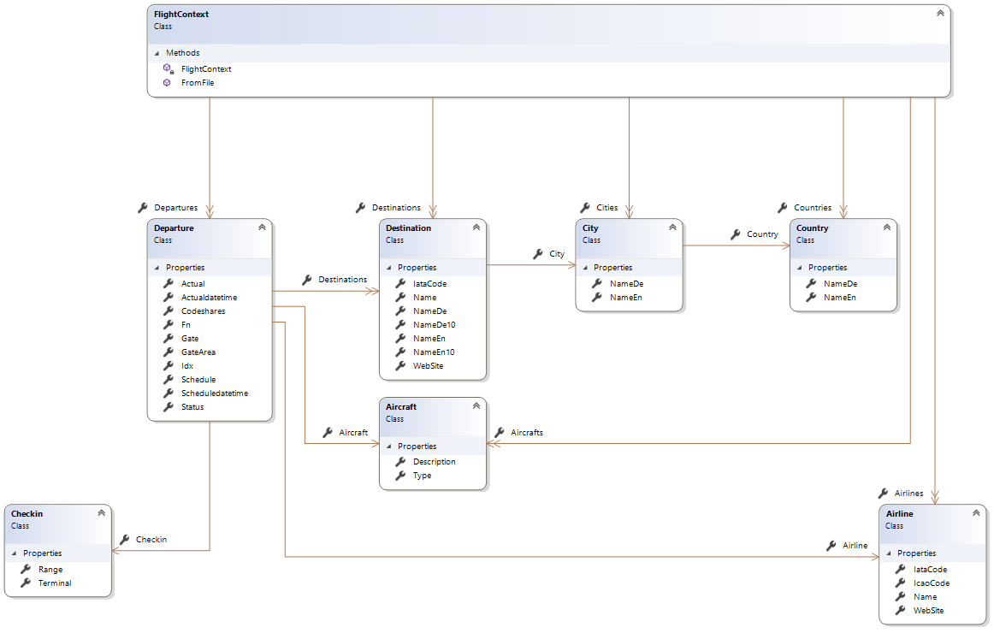

# 2. Praktische LF in C#

Klasse: 3BHIF
Datum: 9. Jänner 2020
Prüfer: SZ

## Aufgabenstellung

Der Flughafen Wien bietet auf seiner [Website](https://www.viennaairport.com/passagiere/ankunft__abflug/abfluege)
eine Liste aller Abflüge an. Aus den JSON Daten wurde ein C# Objektmodell erzeugt, welches so aussieht:

Die Rohdaten sind in der Datei [departure.json](departure.json) enthalten.

In der Datei [Program.cs](Program.cs) sind 8 Beispiele für LINQ Abfragen, die auf diesem Objektmodell
basieren. Schreibe deine Lösung in die entsprechende Variable unter der Beispielangabe.

Für jede gelöste Abfrage gibt es einen Punkt. Die erreichten Punkte und die Beurteilung werden
im Testprogramm sofort ausgegeben.

## Unittests

Die Abfragen werden automatisch geprüft. Ist ein Beispiel falsch, so wird das gelieferte und das
erwartete korrekte Ergebnis ausgegeben. Achte auf die Schreibweise und die Reihenfolge der Properties,
denn es wird zur Überprüfung ein Stringvergleich durchgeführt.

Die korrekten Ergebnisse für den Vergleich befinden sich in der Datei [results.json](results.json).
Bei der Korrektur wird die Datei mit den korrekten Vergleichsergebnissen erneut in den Ordner kopiert.
Änderungen in dieser Datei sind also sinnlos.

## Abgabe

Führe vor der Abgabe bei geschlossenem Visual Studio die Datei *cleanSolution.cmd* aus. Sie entfernt
die kompilierten Dateien. Kopiere danach alle Dateien des Ordners mit der Solution auf
`\\enterprise\ausbildung\unterricht\abgaben\3BHIF\POS_SZ\PLF20200109`
in den entsprechenden persönlichen Ordner. Die Dateien sind **unkomprimiert** abzugeben.
